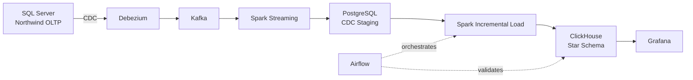

# Northwind Realtime Data Platform

An end-to-end data engineering platform that captures transactional changes from SQL Server, transports them through Kafka, stores an auditable CDC staging layer in PostgreSQL, incrementally builds a ClickHouse star schema, orchestrates pipelines with Apache Airflow, and serves analytics through Grafana.

## Architecture



For design details, see [docs/architecture.md](docs/architecture.md).

## Core capabilities

- SQL Server CDC for `Customers`, `Products`, `Orders`, and `Order Details`.
- Debezium change capture into Apache Kafka.
- PySpark Structured Streaming into an append-only PostgreSQL staging layer.
- Current-state PostgreSQL views reconstructed from CDC events.
- Initial warehouse load from the reference Northwind DW.
- Incremental customer, product, geography, and order-fact synchronization.
- Create, update, and delete handling with ClickHouse tombstones.
- Idempotent watermark-based processing.
- Airflow orchestration and data-quality tasks.
- Provisioned Grafana datasource and nine-panel analytics dashboard.
- Dedicated read-only ClickHouse account for Grafana.
- Automated platform validation.

## Technology stack

| Layer | Technology |
|---|---|
| Operational database | SQL Server 2022 |
| Change data capture | SQL Server CDC + Debezium 3.0 |
| Event streaming | Apache Kafka 4.1 |
| Stream and batch processing | Apache Spark 3.5.9 / PySpark |
| CDC staging | PostgreSQL 16 |
| Analytical warehouse | ClickHouse 25.8 |
| Orchestration | Apache Airflow 2.10.5 |
| Visualization | Grafana 13.2.1 |
| Runtime | Docker Compose |

## Repository layout

```text
airflow/dags/                 Airflow DAG definitions
connectors/debezium/          Debezium connector template
docker/                       Custom Spark, Airflow, and Grafana images
docs/                         Architecture, runbook, and schema reference
grafana/                      Provisioned datasource and dashboard
scripts/                      Registration, setup, and validation scripts
spark/jobs/                   Streaming, initial-load, and incremental jobs
sql/clickhouse/               Warehouse schema and validation SQL
sql/postgres/                 CDC staging, views, and watermark control
sql/sqlserver/                Restore, CDC, security, and smoke-test SQL
compose.yaml                  Database services
compose.override.yaml         Kafka, Connect, and Spark services
compose.airflow.yaml          Airflow services
compose.grafana.yaml          Grafana service
```

## Prerequisites

- Docker Engine with Docker Compose v2 or later.
- At least 16 GB RAM; 24 GB or more is recommended for the complete stack.
- A Northwind reference DW backup placed under `data/backups/`.
- Linux, macOS, or Windows with WSL2.

## Configuration

Create the local environment file:

```bash
cp .env.example .env
```

Replace every `ChangeMe_...` value. Never commit `.env`.

The complete Compose configuration is loaded through:

```dotenv
COMPOSE_FILE=compose.yaml:compose.override.yaml:compose.airflow.yaml:compose.grafana.yaml
```

Host ports used by the supplied example configuration:

| Service | URL or port |
|---|---|
| Grafana | http://localhost:33000 |
| Airflow | http://localhost:38080 |
| Kafka Connect API | http://localhost:8083 |
| Kafka external listener | localhost:29092 |
| SQL Server | localhost:31433 |
| PostgreSQL | localhost:35432 |
| ClickHouse HTTP | http://localhost:38123 |
| ClickHouse native | localhost:39000 |

## Start the platform

```bash
set -a
source .env
set +a

docker compose config --quiet
docker compose up -d
```

First-time database and pipeline initialization is documented in [docs/runbook.md](docs/runbook.md).

## Operational commands

Register or update the Debezium connector:

```bash
./scripts/register-debezium.sh
```

Configure the Grafana read-only ClickHouse user:

```bash
./scripts/setup_grafana_reader.sh
```

Run an incremental warehouse load manually:

```bash
docker compose exec -T spark \
  python3 /opt/northwind/jobs/incremental_load_clickhouse.py
```

Validate the complete platform:

```bash
./scripts/validate_platform.sh
```

## Airflow DAGs

| DAG | Schedule | Purpose |
|---|---|---|
| `northwind_incremental_pipeline` | Every two minutes | Process pending CDC events and validate the warehouse |
| `northwind_full_refresh` | Manual | Rebuild and validate the ClickHouse warehouse |

## Grafana dashboard

Open the provisioned dashboard:

```text
http://localhost:33000/d/northwind-realtime-overview/northwind-realtime-analytics
```

The dashboard includes revenue, order, customer and product KPIs, revenue over time, geographic performance, top products, top customers, and warehouse row health.

## Data-quality guarantees

- Watermarks advance only after successful ClickHouse writes.
- Processed CDC events are marked in PostgreSQL.
- Re-running with no pending events is safe.
- `ReplacingMergeTree` tables use deterministic keys and version columns.
- Source and target counts are validated after initial loading.
- Incremental validation checks duplicate active keys and fact integrity.
- Grafana authenticates through a read-only ClickHouse user.

## Documentation

- [Architecture](docs/architecture.md)
- [Operations runbook](docs/runbook.md)
- [Reference warehouse schema](docs/reference_dw_schema.txt)

## Author

Anita Bakhshi
