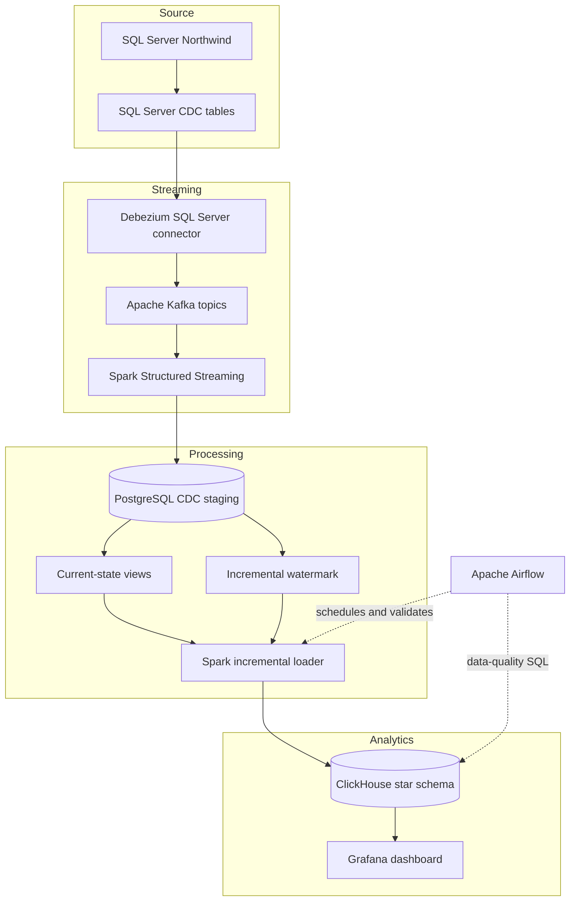
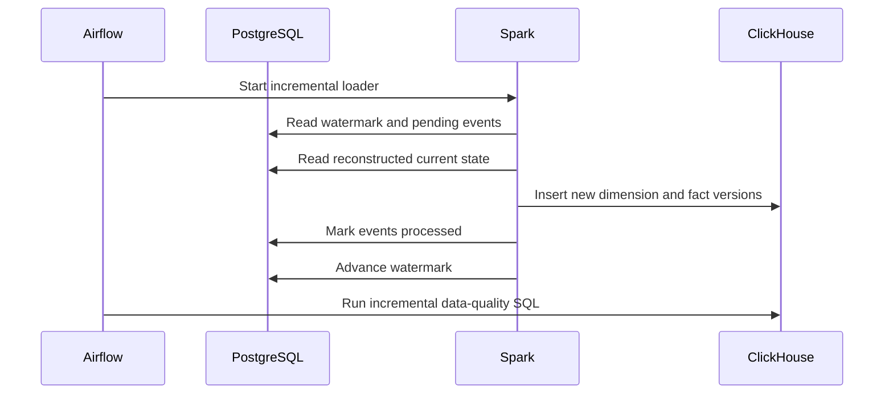

# Platform Architecture

## End-to-end data flow

## Data contracts

Debezium publishes JSON events with source metadata, operation type, before image, and after image. Spark normalizes these messages into `staging.cdc_events` without discarding the original payload.

The staging table provides:

- A monotonic `event_id` used by the incremental watermark.
- `source_table` and CDC `operation` values.
- `before_data` and `after_data` JSON documents.
- Kafka topic, partition, and offset metadata.
- Processing state and timestamp fields.

PostgreSQL current-state views select the latest event for each business key and exclude deleted entities.

## Warehouse model

The `northwind_dw` ClickHouse database contains:

### Dimensions

- `dim_date`
- `dim_geography`
- `dim_customer`
- `dim_employees`
- `dim_suppliers`
- `dim_products`
- `dim_shippers`
- `dim_territories`

### Facts

- `fact_orders`
- `fact_employee_territories`

Mutable analytical entities use `ReplacingMergeTree`. Queries that require the latest logical row use `FINAL`. Deletions are represented by `is_deleted = 1`, preserving an audit trail instead of physically removing rows.

## Incremental processing sequence

If a ClickHouse write or validation fails, the job exits non-zero. The watermark does not advance before successful processing, allowing the batch to be retried.

## Orchestration

Airflow uses `LocalExecutor` and PostgreSQL metadata storage. The scheduler invokes commands in the existing Spark and ClickHouse containers through the Docker API.

The incremental DAG runs every two minutes with a maximum of one active run. The full-refresh DAG is manual to prevent accidental warehouse truncation.

## Security boundaries

- Secrets are stored only in the ignored `.env` file.
- `.env.example` contains placeholders.
- Debezium uses a dedicated SQL Server login.
- Grafana uses `grafana_reader`, which has `SELECT` access only.
- The Grafana settings profile enforces `readonly = 1` while allowing the plugin to modify `max_execution_time`.
- Airflow Docker socket access is granted through the host socket GID rather than world-writable permissions.

## Persistence

Named Docker volumes persist SQL Server, PostgreSQL, ClickHouse, Kafka, Airflow metadata, Spark checkpoints, and Grafana state. Source-controlled SQL and provisioning files remain separate from runtime data.
